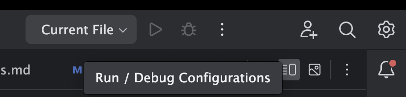
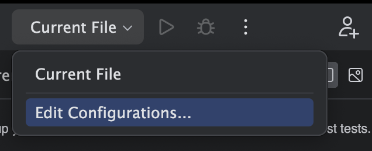
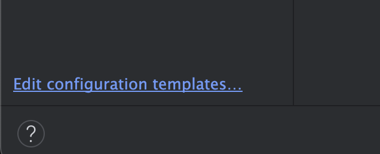
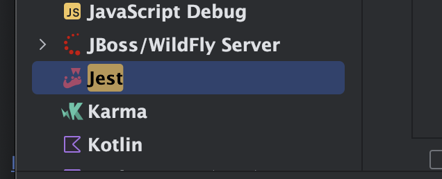
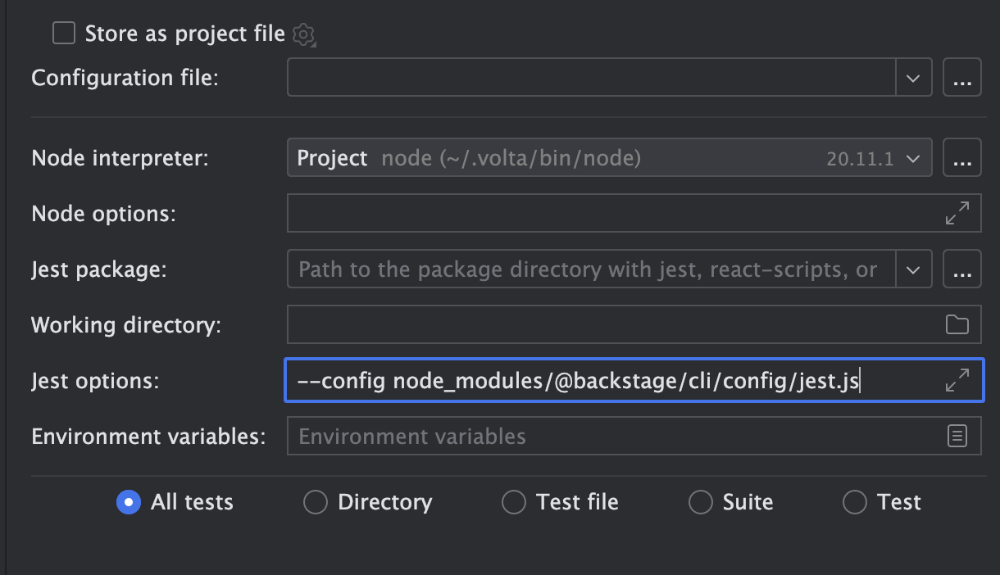

## Jest

This will be a short blog how to set up your Webstorm instance to debug Backstage and its Jest tests.
If you are getting `Jest encountered an unexpected token` on a Backstage repo while debugging with Webstorm.

1. Run configurations
   

2. "Edit configurations..."
   

3. "Edit configuration templates"
   

4. "Jest"
   

5. Add the following test "Jest options"

    ```text title="Jest options"
    --config node_modules/@backstage/cli/config/jest.js
    ```

   This will use the jest config, also used by `backstage-cli`.
   

6. Ensure that the working directory is set to that directory which contains root `package.json`

With that, you are good to go!
