As a Renovate maintainer, the question I answer most often is not "why is Renovate broken?" but "why did Renovate do that with my config?".
The honest answer is usually "because you configured it that way", and finding out where is the hard part.
Every one of these mysteries ends the same way: you pull off the mask, and it was a packageRule all along.
The [Renovate Config Debugger](https://renovate.secustor.dev/) is my attempt to make that answer visible before Renovate runs.

<!--more-->

## Why

I have been maintaining Renovate for a few years now, and I see the same story in the [discussions](https://github.com/renovatebot/renovate/discussions) every week.
I see it at work too, where I am the person colleagues ping when a Renovate PR looks wrong.
Someone extends `config:best-practices`, adds a shared preset from their organisation, writes a handful of `packageRules`, and then a PR shows up that does not match what they wrote.

Part of the problem is sheer size.
Renovate 44.42.1 has 486 configuration options, 379 of which you can set in a repository config, and most of them are valid at the top level, inside a preset, and inside a `packageRule` at the same time.
Every one of those places has a different precedence.
Nobody keeps that in their head, and I say that as someone who reviews the pull requests that add new options.

The advice we maintainers give is always the same: run Renovate with `LOG_LEVEL=debug`, search the log for `packageFiles with updates`, and read the JSON blob for the dependency in question.
That advice is correct, and I have typed it hundreds of times.
It is also a bad experience.
You jump between your `renovate.json`, the preset sources in the Renovate repository, the docs, and a log file, trying to reconstruct in your head which of the seven hundred rules touched your dependency and in which order.
Most of the time I can do that reconstruction from memory, because I know where the presets live.
Users cannot, and they should not have to.

Others have felt the same pain and built tools to make the log easier to read.
Marius Shekow's [renovate-log-parser](https://github.com/MShekow/renovate-log-parser) loads a debug log into a queryable database, and fellow maintainer Jamie Tanna's [renovate-pretty-log](https://gitlab.com/tanna.dev/renovate-pretty-log) turns the JSON lines into something you can scan.
Both are good, and I recommend them when you already have a log.
But they work on the output of a run.
The log tells you the final config a dependency ended up with, not how it got there.

So I built the tool that does the reconstruction.
The Renovate Config Debugger runs the whole config pipeline instead, parse, migrate, validate, preset resolution, merge, and keeps every intermediate result.
So you do not only see the end value, you see what each preset contributed, which rule overwrote it, and in which order.
And it does all of that while the config is still in the editor, before Renovate has run at all.

## The config

Here is a config that looks like many I get pasted into discussions.
Three intentions, all of them reasonable:

```json title="renovate.json"
{
  "$schema": "https://docs.renovatebot.com/renovate-schema.json",
  "extends": ["config:best-practices", ":semanticCommits", "group:allNonMajor"],
  "minimumReleaseAge": "14 days",
  "packageRules": [
    {
      "description": "Auto-merge non-major devDependencies",
      "matchDepTypes": ["devDependencies"],
      "matchUpdateTypes": ["minor", "patch"],
      "automerge": true
    },
    {
      "description": "Keep AWS SDK on its own PR",
      "matchPackageNames": ["aws-sdk"],
      "groupName": "aws-sdk",
      "automerge": false
    }
  ]
}
```

1. Wait 14 days before proposing any update.
2. Auto-merge minor and patch updates of devDependencies.
3. Keep the AWS SDK out of the big "all non-major" group, on its own PR.

Renovate accepts this config without a single warning, though two of the three intentions do not work.

## Running it

Paste the config into [renovate.secustor.dev](https://renovate.secustor.dev/) and hit Run.
The overview already tells you something interesting: those three `extends` entries expand into 1,097 presets.
Only 11 of them set options, the rest are package grouping rules.

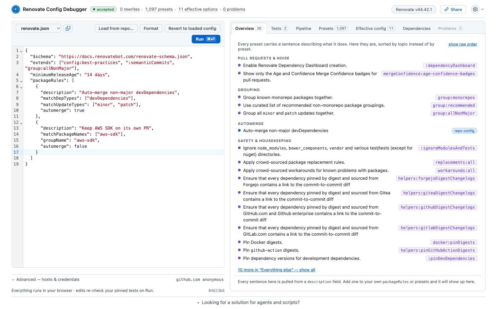

That number is the reason config debugging is hard.
Your two rules are evaluated together with 732 others, and later rules win.

## Symptom 1: the AWS SDK lands in the wrong PR

The Tests tab lets you describe a hypothetical update and see what Renovate would do with it.
You can fill in the form, or paste the dependency JSON straight from a debug log.
Yes, the same `packageFiles with updates` blob you used to read by hand.

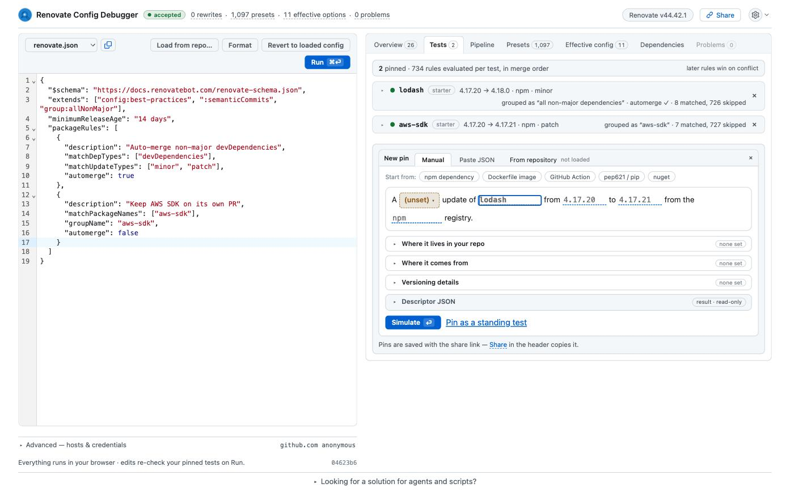

Let's test a minor update of `@aws-sdk/client-s3`, the package people actually have in their `package.json` today.

The verdict is one sentence: this update **would be grouped as "all non-major dependencies"**.
Not "aws-sdk".
Below the verdict, the debugger lists every rule that matched and, more importantly, the rules from your own config that did not.
Each one gets a matcher checklist:

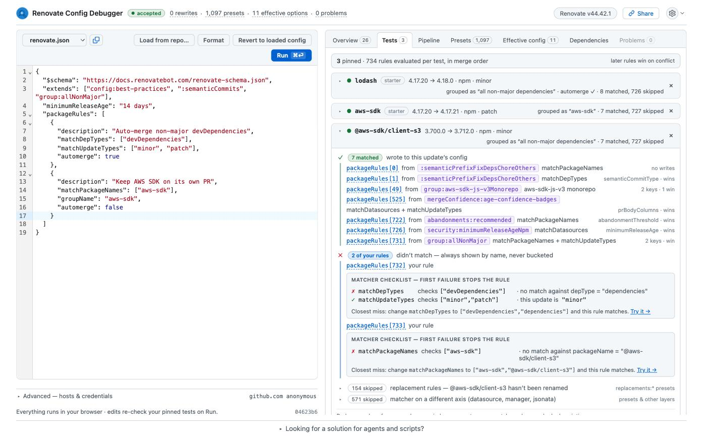

`matchPackageNames` checks `["aws-sdk"]` against `@aws-sdk/client-s3` and fails.
`matchPackageNames` is an exact match unless you use a glob or a regex, and the v3 SDK is a scoped package.
The debugger even proposes the closest fix.

I have answered this exact question in the discussions more times than I can count, and we even renamed and re-documented the option along the way because it kept coming up.
Pointing someone at a checklist that names the failing matcher and the input it saw is a lot nicer than explaining string matching semantics in a thread.

## The fight over groupName

Fixing the matcher is easy: `"matchPackageNames": ["aws-sdk", "@aws-sdk/**"]`.
But the interesting part is what happens to `groupName` on the way to the final answer.
Open the full simulator and expand the `groupName` row:

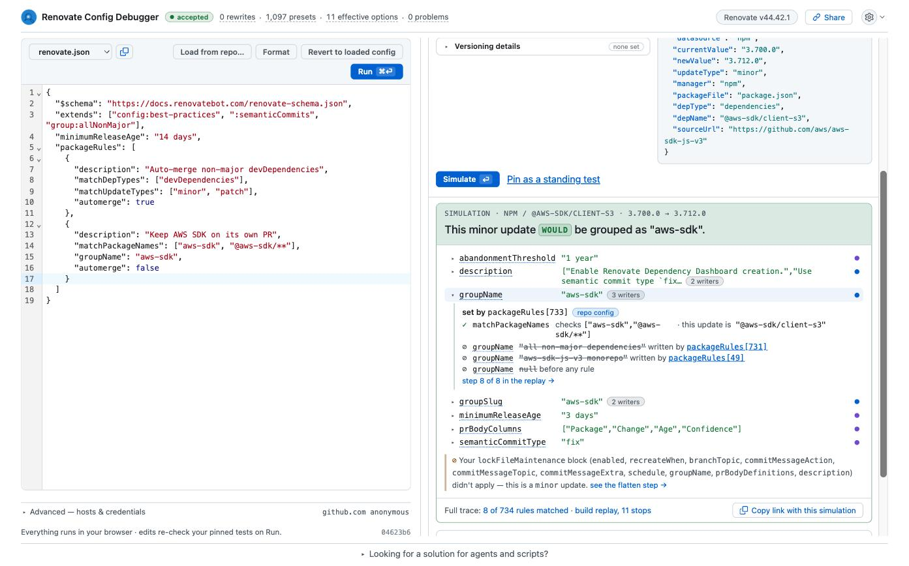

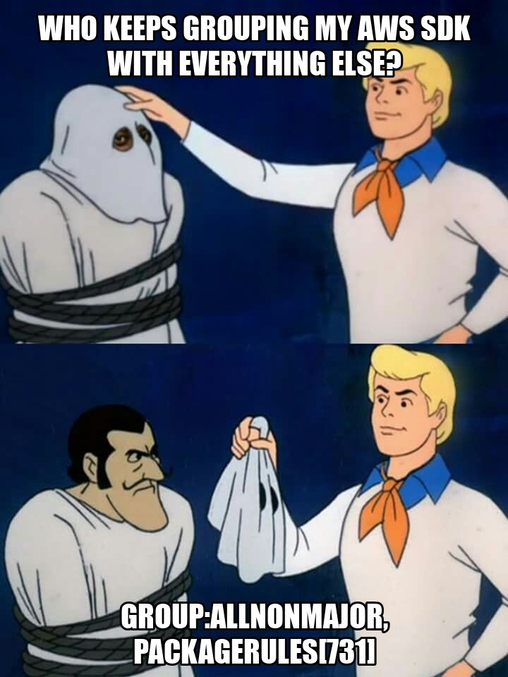

Three rules wrote this one option, in merge order:

1. `group:aws-sdk-js-v3Monorepo`, pulled in by `config:best-practices`, sets it to `aws-sdk-js-v3 monorepo`.
2. `group:allNonMajor` overwrites it with `all non-major dependencies`.
3. Your own rule, `packageRules[733]` in the merged list, overwrites it again with `aws-sdk`.

Before the fix, only the first two wrote it and the preset won.
This chain is what you had to reconstruct from the debug log before.
Now it is one click.

## Symptom 2: minimumReleaseAge is ignored for npm

The second problem is more subtle, and since `config:best-practices` became the recommended starting point it has turned into one of the most frequent discussions we get ([#39963](https://github.com/renovatebot/renovate/discussions/39963), [#37952](https://github.com/renovatebot/renovate/discussions/37952), [#42610](https://github.com/renovatebot/renovate/discussions/42610)).
You set `minimumReleaseAge` to 14 days at the top level, and npm updates still show up after three.
This one is on us: the behaviour is documented, but nothing in the user's own file hints at it.

The Effective config tab shows the cascade for the repository-wide value.
Your repo config sets it, nothing overrides it, 14 days is final:

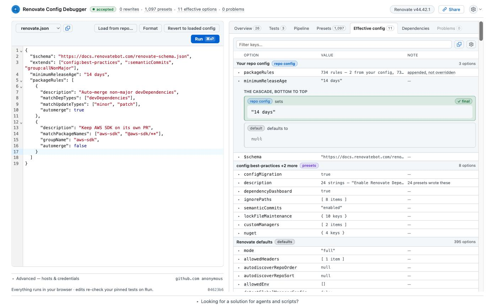

So why three days?
Because `config:best-practices` includes `security:minimumReleaseAgeNpm`, and that preset carries a `packageRule` matching every npm dependency.
A package rule beats a top-level option, no matter where the option was written.
That is by design, and it is the design I defend in the discussions, but it should be visible.
Back in the simulator, the `minimumReleaseAge` row for `@aws-sdk/client-s3` shows exactly that:

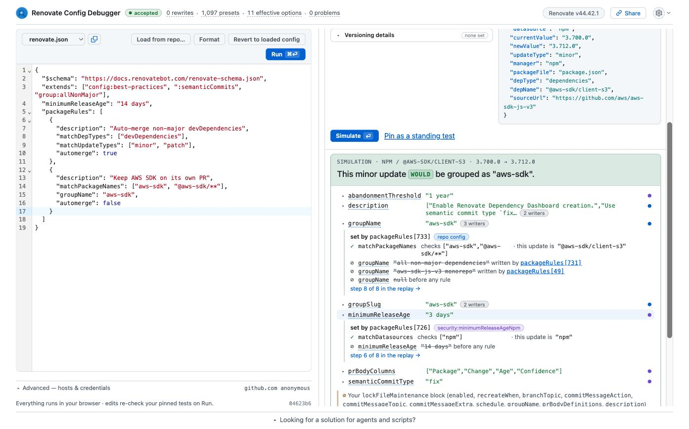

Your 14 days are struck through, written over by `packageRules[726]` from `security:minimumReleaseAgeNpm`.

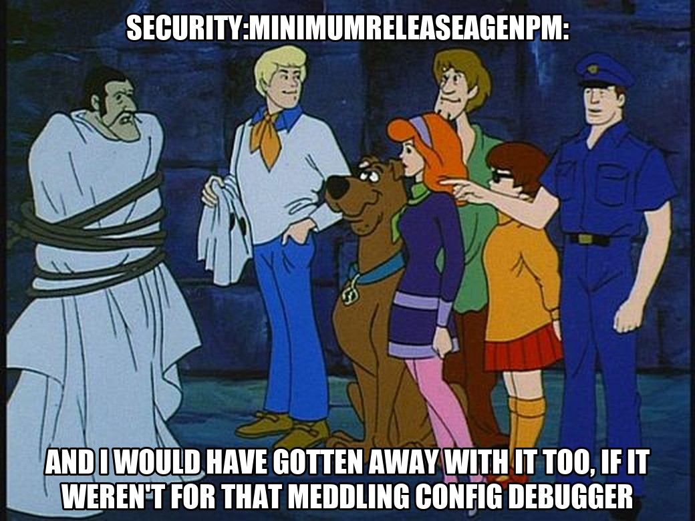

Click on the preset tab to jump to that preset in the Presets tab or
go yourself to the tab filtered by option name, shows where that rule lives in the tree:

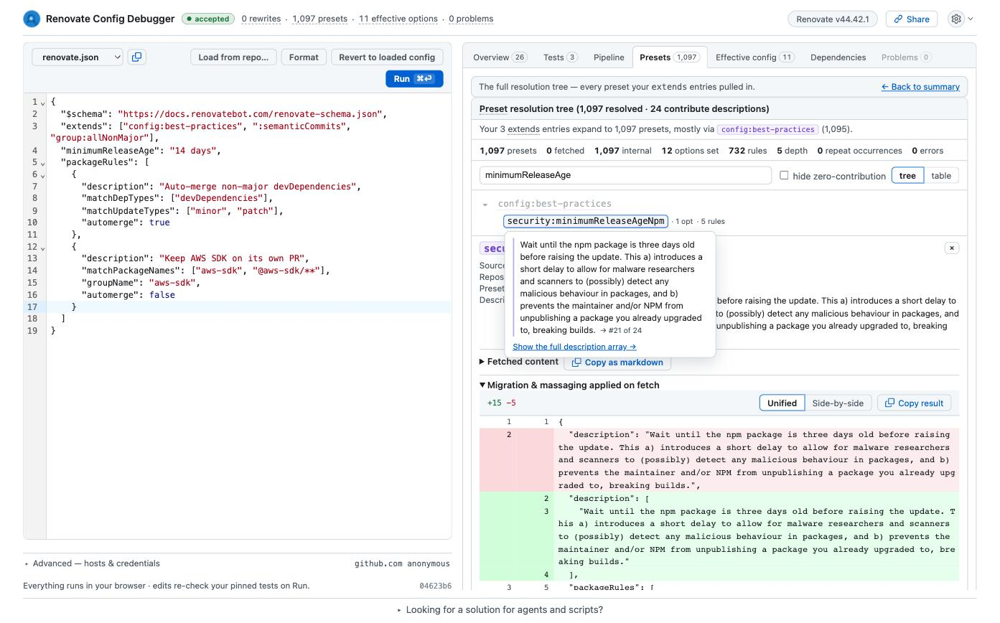

The fix is either `"ignorePresets": ["security:minimumReleaseAgeNpm"]` or a match-all package rule at the end of your list.
Both can be verified the same way: edit, run, and the pinned tests re-evaluate.

## Real dependencies, not made-up ones

Describing a hypothetical update by hand is fine for a blog post, but in practice you want to test the dependencies you actually have.
So load the repository instead:

1. Click **Load from repo…** above the editor.
2. Enter `owner/repo` or paste the GitHub URL. A branch or tag is optional, the default branch is used otherwise.
3. Tick **Also load the org's inherited config** if your organisation uses one, and adjust the path if it is not the default.
4. Click **Load**. The repository's `renovate.json` replaces the editor content, and the pipeline runs against it.

Public repositories work without signing in, but you will hit the GitHub rate limiting for anonymous requests (60 requests per minute) pretty fast.
So it is recommended to sign in with GitHub via the gear menu.
For private ones, sign in and install the [GitHub App](https://github.com/apps/renovate-config-debugger/installations/new) on the repositories you want to inspect.
Signing in alone grants nothing, the app installation decides what the debugger may read.

With the repository loaded, the debugger runs Renovate's real managers over its files, the same extraction step the bot performs at the start of every run.
The Dependencies tab lists what it found, per package file, with the manager, datasource and depType that the package rules will match against.

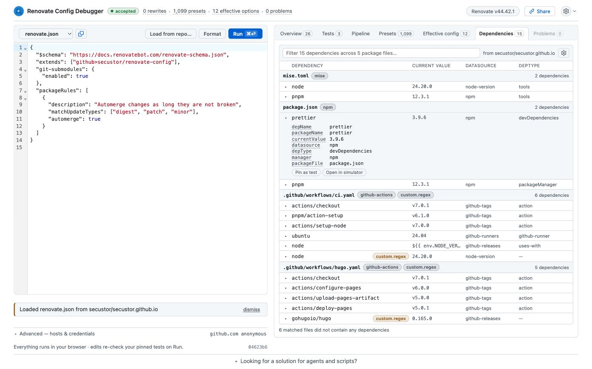

This repository is my blog.
Renovate found 15 dependencies across 5 files, from the npm manager, mise, GitHub Actions and two custom regex managers, and it pulled in the shared preset from my `github>secustor/renovate-config` repository on the way.
Any row can be pinned as a test with one click, so "which rules apply to my `actions/checkout` pin" is answered against the real file, not a guess at how the manager names things.
No version lookup happens, though.
The debugger knows what you depend on, not what updates are pending.

## Small things that add up

Every option name in the result links to its documentation, with the type and where it may be used.
No more searching the docs page for the right anchor.

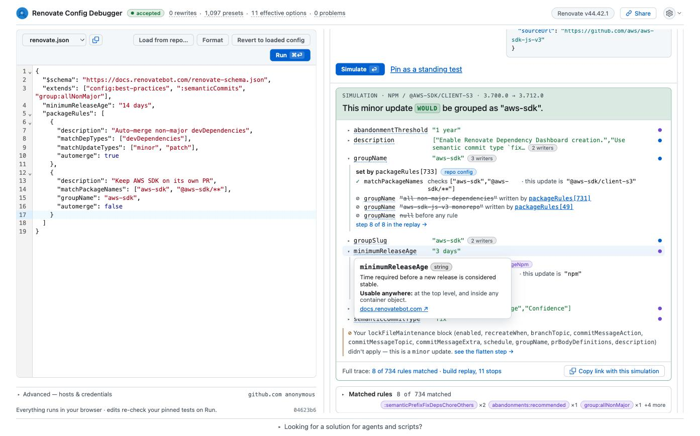

Pinned tests survive edits, even if they are derived from dependencies.
Pin the dependencies you care about, and every config change re-runs them, like unit tests for your `renovate.json`.
The share link carries the config and the pins, so you can send a colleague the exact state instead of a screenshot.
Here is the one for this post: [open the example](https://renovate.secustor.dev/#config=hVNNb9swDP0rArFTYTufwAAdigULdikWFOm6HeocFJlxlFofkOhkQZD_Psh2nHbZ0JNMiu_xkX46wR74OAGPxu4FIXCYTrPpOBtBAtKajSqBwyk3jOXwKcgtapEDZzlsiVzgg0FhZcgu8LWlTFo9uMRpi8h2wZockpYGfxOaIkSal7xrwtcYKHVeSFISQw4Jy4EH1MKQkl-t1oq6bOlt7bioqoU138XO-hxWHbNWRulaL7FCEXBWYit1NGWFOIZegBPyVZS4rCvsVBjGGDu1R6woMEivHKkoO1LMarKpRl8iM9akOvZlBe7n6NAUaKTCC3_LoAXJ7Rzdj6O7NIGb-tXfgGdXCMK3GK1MnDBpZJPcvgeJmmyjKlaTr7G9OicfT_SA6Njs1xN7mj8wa5iiwOzBsMfl7RyP7cIWQve6xCGkoXhtlX3posHd3Xt9zb-KsLbnFfSfETaiCpcZ4rHKzRkS2KiqaQ68N2pjqehR4DBa02QyUpDAXuEB-AkCiTJWO48BCRIwtojx_T_ddh9Q1l7Rkd8YaOE0JEBi3ZMFOCfglAnAX06ghREleuBgmspCkAi29hL7lLsuD_h1VbJSaCgNk4hC98F1tATw-NXb50r9TVXNsG3Ub6b2Hg39FFUdbyfZ5-EwG8Zd4OFNcjRuknXvPOCt6SCBdpJnXwHv33upaFuvm1cuDmHQ6U13Id1P4Lw6_wE).

**Note: The shared link carries the config, the pipeline layers and the pinned tests, but not the dependencies extracted from a loaded repository. Private package names cannot leak through it.**

## Same answers in the terminal

The web app is the easiest entry point, but the engine also ships as a CLI.
Node 24 is required, nothing else to install:

```console title="rcd simulate"
$ npx -y @renovate-config-debugger/cli simulate renovate.json \
    --dep '{"depName":"@aws-sdk/client-s3","datasource":"npm","manager":"npm","depType":"dependencies","currentValue":"3.700.0","newValue":"3.712.0","sourceUrl":"https://github.com/aws/aws-sdk-js-v3"}'
This minor update WOULD be grouped as "all non-major dependencies".

7 of 734 packageRules matched — rule numbers are merged packageRules[N] indexes, and `--rule <n>` takes them verbatim.

  #49 matched (matchUpdateTypes=matched, matchSourceUrls=matched) [preset group:aws-sdk-js-v3Monorepo packageRules[0]]
      sets groupName = "aws-sdk-js-v3 monorepo"
  #726 matched (matchDatasources=matched) [preset security:minimumReleaseAgeNpm packageRules[0]]
      sets minimumReleaseAge = "3 days"
  #731 matched (matchPackageNames=matched, matchUpdateTypes=matched) [preset group:allNonMajor packageRules[0]]
      sets groupName = "all non-major dependencies"
      sets groupSlug = "all-minor-patch"
727 of 734 rules hidden by --verdict notable — `--verdict all --source all` shows every rule.
```

`rcd validate` exits with code 2 when Renovate would reject the config, which makes it a cheap CI check.
`rcd compare before.json after.json --dep '...'` tells you whether an edit changed behaviour for a dependency, or only moved text around.

All commands have a `--format json` option in case you want to process the output.

## Let the agent ask

The same commands are available as an MCP server, and there is a Claude Code plugin that wraps it together with a skill describing the debugging workflow:

```shell title="Claude Code"
/plugin marketplace add secustor/claude-marketplace
/plugin install renovate-config-debugger@secustor
```

With that installed, "why is `@aws-sdk/client-s3` grouped with everything else?" gets answered from Renovate's real resolution instead of from what the model remembers about presets.
I have reviewed enough agent-written Renovate configs by now to know that the memory is often a few releases stale.
The plugin also runs the validator before proposing an edit, which is the part I trust the least when an agent touches a config file.

The MCP server is not tied to Claude Code.
It speaks plain stdio, so any harness that can start a process gets the same tools:

```shell title="Register the MCP server"
# Claude Code without the plugin, and Codex
claude mcp add rcd -- npx -y @renovate-config-debugger/cli mcp
codex mcp add rcd -- npx -y @renovate-config-debugger/cli mcp
```

Cursor, Gemini CLI and VS Code with Copilot take a config file instead, all with the same shape:

```json title=".cursor/mcp.json, .gemini/settings.json or .vscode/mcp.json"
{
  "mcpServers": {
    "rcd": {
      "type": "stdio",
      "command": "npx",
      "args": ["-y", "@renovate-config-debugger/cli", "mcp"]
    }
  }
}
```

VS Code names the top-level key `servers` instead of `mcpServers`.
What you lose without the Claude Code plugin is the skill that knows the call sequence, so you may have to tell the agent to start with `run_config` and keep the returned run id for the follow-up questions.

If you prefer to self-host, `docker run -p 8080:80 ghcr.io/secustor/renovate-config-debugger` serves the web app, though that is not necessary for the MCP server.

## What it does not do

- The CLI and MCP server are still 0.x. Flags and output shapes may change.
- It extracts dependencies from a loaded repository but does not look up versions, so it does not know which updates are actually pending (for now). Simulations describe one hypothetical update at a time.
- Presets hosted on Azure DevOps, Bitbucket and Gerrit via `local>` cannot be fetched from the browser.
- Answers are for the pinned Renovate version shown in the header, currently 44.42.1.

## Conclusion

Most of the config questions we get as maintainers are not about Renovate being wrong™.
They are about not seeing which of a thousand presets touched a value last, and generally the multitude of ways Renovate can be configured.
The debugger makes that visible before the PR exists, and it does so with Renovate's own code, so the answer is the one you would have found in the log, minus the log.

Try it at [renovate.secustor.dev](https://renovate.secustor.dev/), the source is on [GitHub](https://github.com/secustor/renovate-config-debugger).
If it gives you a wrong answer, or the right answer in a confusing way, please open an issue there.
And if you are about to open a Renovate discussion about a packageRule, paste the share link.
It will make the answer faster for both of us.
