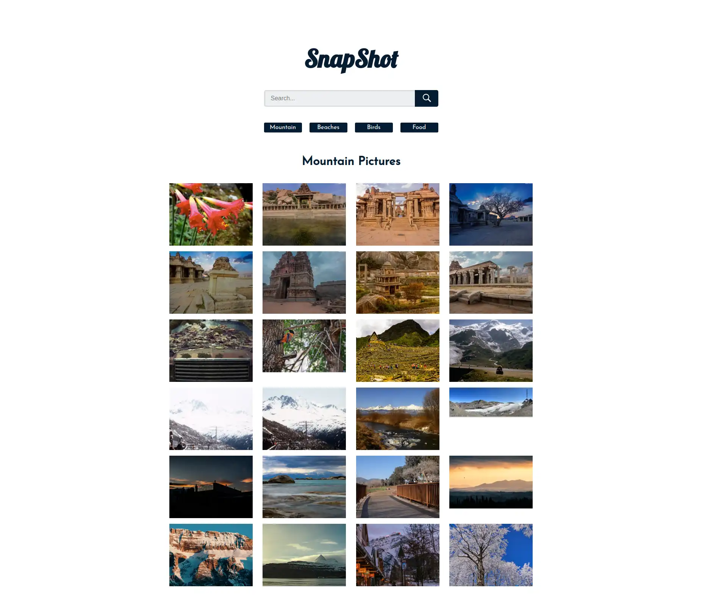

In this talk, I give an overview of what OpenTelemetry (OTeL) is and what it can help you to achieve.
The example consists of multiple microservices which are deployed in a Kubernetes cluster fully traced with OTeL.
The traced components are:

- React frontend
- Kubernetes Ingress Controller
- API backend
- Kafka
- Asynchronous processing microservice



Repository: <https://github.com/secustor/opentelemetry-meetup>

## Components

### Snapshot

[Snapshot](https://github.com/Yog9/SnapShot) is a React photo gallery to showcase capabilities.
In this example,
OpenTelemetry tracing capabilities have been added
to allow an easy way to demonstrate the capture of user input and API call tracing.

Code: <https://github.com/secustor/opentelemetry-meetup/tree/master/apps/snapshot>

#### Report

The `report` consists of the Kafka producer
which accepts API calls from [Snapshot](#snapshot) and writes the request content on a Kafka topic.
From this Kafka topic, the consumer reads the received messages asynchronously and prints them.

Code: <https://github.com/secustor/opentelemetry-meetup/tree/master/apps/report>

#### OpenTelemetry

The example makes use of the [OpenTelemetry Collector](https://github.com/open-telemetry/opentelemetry-collector-contrib/) and [SDKs](https://opentelemetry.io/ecosystem/registry/?component=core)
for collecting, transforming as well as loading and for instrumentation respectively.

#### Observability Stack

The Stack below is used to store Observability signals ( Traces, Metrics, Logs ) and graph them:

- [Grafana](https://github.com/grafana/grafana/) ( Dashboarding )
- [Tempo](https://github.com/grafana/tempo) ( Traces )
- [Loki](https://github.com/grafana/loki) ( Logs)
- [Prometheus](https://github.com/prometheus/prometheus) ( Metrics )
